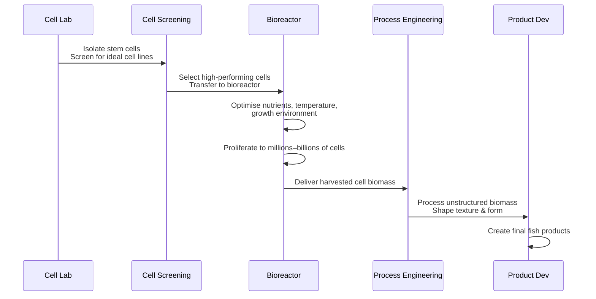

## New Food Manufacturing

```mermaid
sequenceDiagram
    participant Lab as Cell Lab
    participant QA as Cell Screening
    participant Bio as Bioreactor
    participant Eng as Process Engineering
    participant Prod as Product Dev

    Lab->>QA: Isolate stem cells<br/>Screen for ideal cell lines
    QA->>Bio: Select high-performing cells<br/>Transfer to bioreactor
    Bio->>Bio: Optimise nutrients, temperature,<br/>growth environment
    Bio->>Bio: Proliferate to millions–billions of cells
    Bio->>Eng: Deliver harvested cell biomass
    Eng->>Prod: Process unstructured biomass<br/>Shape texture & form
    Prod->>Prod: Create final fish products
```
