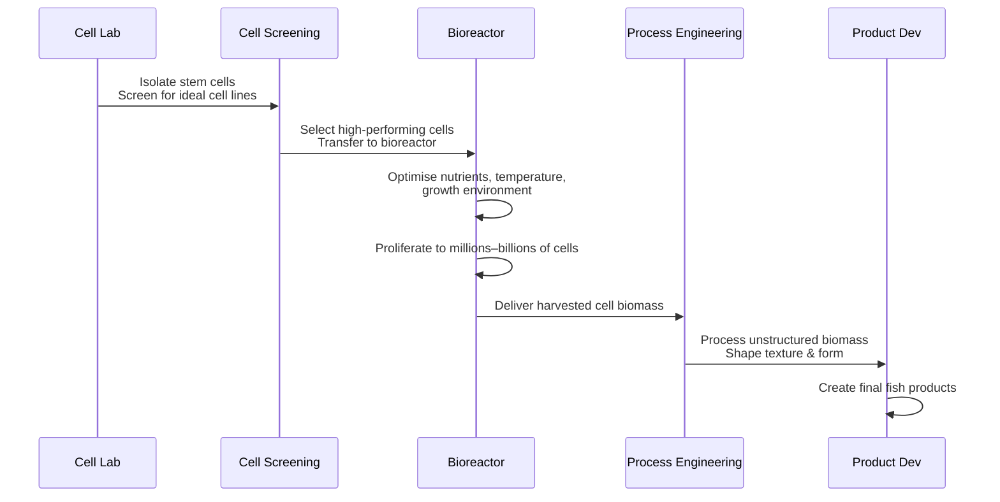
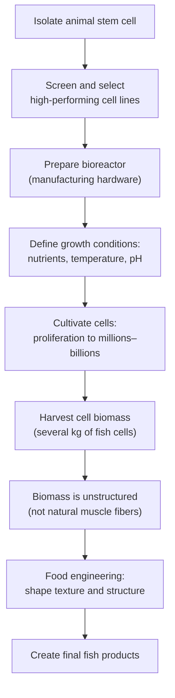

## New Food Manufacturing

```mermaid
sequenceDiagram
    participant Lab as Cell Lab
    participant QA as Cell Screening
    participant Bio as Bioreactor
    participant Eng as Process Engineering
    participant Prod as Product Dev

    Lab->>QA: Isolate stem cells<br/>Screen for ideal cell lines
    QA->>Bio: Select high-performing cells<br/>Transfer to bioreactor
    Bio->>Bio: Optimise nutrients, temperature,<br/>growth environment
    Bio->>Bio: Proliferate to millions–billions of cells
    Bio->>Eng: Deliver harvested cell biomass
    Eng->>Prod: Process unstructured biomass<br/>Shape texture & form
    Prod->>Prod: Create final fish products
```

```mermaid
flowchart TD
    A["Isolate animal stem cell"] --> B["Screen and select\nhigh-performing cell lines"]
    B --> C["Prepare bioreactor\n(manufacturing hardware)"]
    C --> D["Define growth conditions:\nnutrients, temperature, pH"]
    D --> E["Cultivate cells:\nproliferation to millions–billions"]
    E --> F["Harvest cell biomass\n(several kg of fish cells)"]
    F --> G["Biomass is unstructured\n(not natural muscle fibers)"]
    G --> H["Food engineering:\nshape texture and structure"]
    H --> I["Create final fish products"]
```
