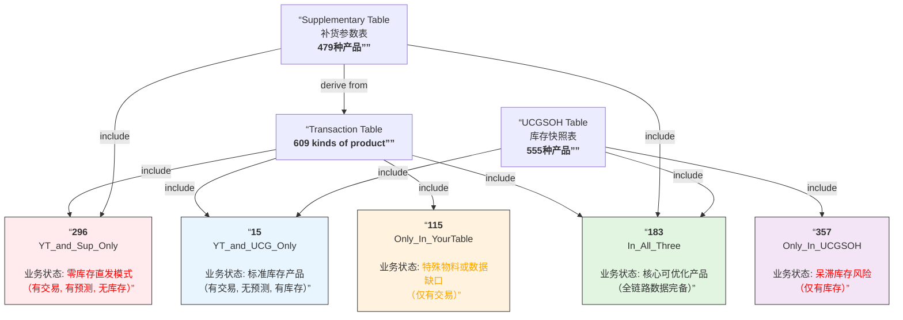

```mermaid
flowchart TD
    A[“Transaction Table<br><b>609 kinds of product””]

    B[“Supplementary Table<br>补货参数表<br><b>479种产品””]

    C[“UCGSOH Table<br>库存快照表<br><b>555种产品””]

    AB[“<b>296</b><br>YT_and_Sup_Only<br><br>业务状态: <font color=red>零库存直发模式<br>（有交易, 有预测, 无库存）”]

    AC[“<b>15</b><br>YT_and_UCG_Only<br><br>业务状态: 标准库存产品<br>（有交易, 无预测, 有库存）”]

    A_Only[“<b>115</b><br>Only_In_YourTable<br><br>业务状态: <font color=orange>特殊物料或数据缺口<br>（仅有交易）”]

    C_Only[“<b>357</b><br>Only_In_UCGSOH<br><br>业务状态: <font color=red>呆滞库存风险<br>（仅有库存）”]

    ABC[“<b>183</b><br>In_All_Three<br><br>业务状态: 核心可优化产品<br>（全链路数据完备）”]

    A -->|include| AB
    A -->|include| AC
    A -->|include| A_Only
    A -->|include| ABC

    B -->|derive from| A
    B -->|include| AB
    B -->|include| ABC

    C -->|include| AC
    C -->|include| C_Only
    C -->|include| ABC

    style ABC fill:#e1f5e1,stroke:#333
    style AB fill:#ffebee,stroke:#333
    style A_Only fill:#fff3e0,stroke:#333
    style C_Only fill:#f3e5f5,stroke:#333
    style AC fill:#e8f5fe,stroke:#333
```
