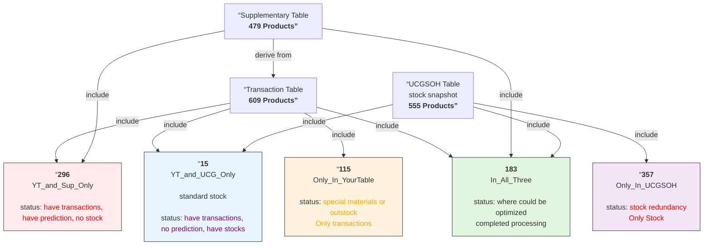

```mermaid
flowchart TD
    A[“Transaction Table<br><b>609 Products”]

    B[“Supplementary Table<br><b>479 Products”]

    C[“UCGSOH Table<br>stock snapshot<br><b>555 Products”]

    AB[“<b>296</b><br>YT_and_Sup_Only<br><br>status: <font color=red>have transactions, have prediction, no stock]

    AC[“<b>15</b><br>YT_and_UCG_Only<br><br>standard stock<br><br>status: <font color=purple>have transactions, no prediction, have stocks]

    A_Only[“<b>115</b><br>Only_In_YourTable<br><br>status: <font color=orange>special materials or outstock<br>Only transactions]

    C_Only[“<b>357</b><br>Only_In_UCGSOH<br><br>status: <font color=red>stock redundancy<br>Only Stock]

    ABC["<b>183</b><br>In_All_Three<br><br>status: where could be optimized<br>completed processing"]

    A -->|include| AB
    A -->|include| AC
    A -->|include| A_Only
    A -->|include| ABC

    B -->|derive from| A
    B -->|include| AB
    B -->|include| ABC

    C -->|include| AC
    C -->|include| C_Only
    C -->|include| ABC

    style ABC fill:#e1f5e1,stroke:#333
    style AB fill:#ffebee,stroke:#333
    style A_Only fill:#fff3e0,stroke:#333
    style C_Only fill:#f3e5f5,stroke:#333
    style AC fill:#e8f5fe,stroke:#333
```
