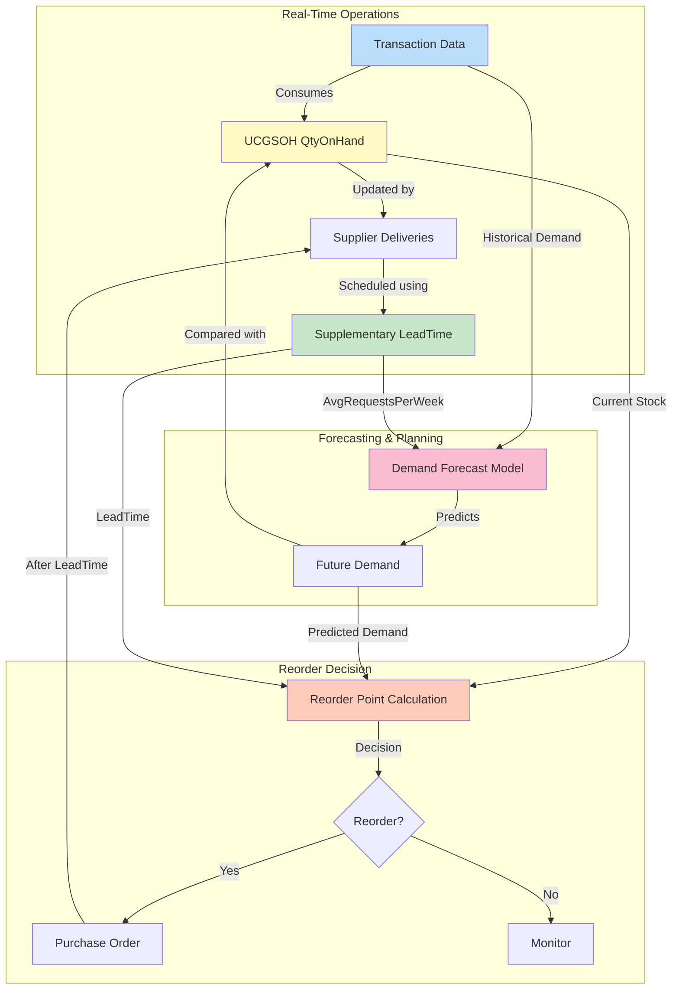

```mermaid
graph TB
    subgraph "Real-Time Operations"
        A[Transaction Data] -->|Consumes| B[UCGSOH QtyOnHand]
        B -->|Updated by| C[Supplier Deliveries]
        C -->|Scheduled using| D[Supplementary LeadTime]
    end
    
    subgraph "Forecasting & Planning"
        A -->|Historical Demand| E[Demand Forecast Model]
        D -->|AvgRequestsPerWeek| E
        E -->|Predicts| F[Future Demand]
        F -->|Compared with| B
    end
    
    subgraph "Reorder Decision"
        B -->|Current Stock| G[Reorder Point Calculation]
        F -->|Predicted Demand| G
        D -->|LeadTime| G
        G -->|Decision| H{Reorder?}
        H -->|Yes| I[Purchase Order]
        H -->|No| J[Monitor]
        I -->|After LeadTime| C
    end
    
    style A fill:#bbdefb
    style B fill:#fff9c4
    style D fill:#c8e6c9
    style E fill:#f8bbd0
    style G fill:#ffccbc
```
