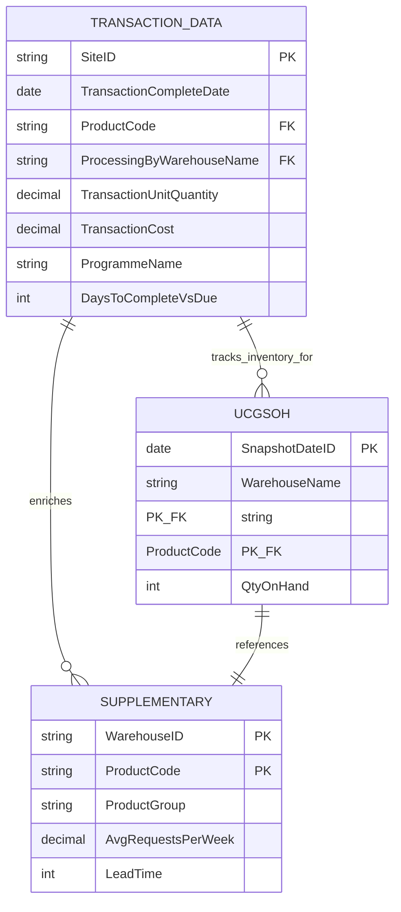

```mermaid
erDiagram
    TRANSACTION_DATA ||--o{ UCGSOH : "tracks_inventory_for"
    TRANSACTION_DATA ||--o{ SUPPLEMENTARY : "enriches"
    UCGSOH ||--|| SUPPLEMENTARY : "references"
    
    TRANSACTION_DATA {
        string SiteID PK
        date TransactionCompleteDate
        string ProductCode FK
        string ProcessingByWarehouseName FK
        decimal TransactionUnitQuantity
        decimal TransactionCost
        string ProgrammeName
        int DaysToCompleteVsDue
    }
    
    UCGSOH {
        date SnapshotDateID PK
        string WarehouseName PK_FK
        string ProductCode PK_FK
        int QtyOnHand
    }
    
    SUPPLEMENTARY {
        string WarehouseID PK
        string ProductCode PK
        string ProductGroup
        decimal AvgRequestsPerWeek
        int LeadTime
    }
```
