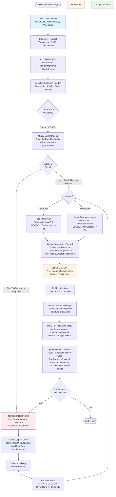

```mermaid
flowchart TD
    Start([Daily Operations Begin]) --> CheckInventory[Check Stock Levels<br/>UCGSOH: QtyOnHand by Warehouse]
    
    CheckInventory --> CustomerRequest[Customer Request<br/>Transaction: SiteID, JobDueDate]
    
    CustomerRequest --> JobClass[Job Classification<br/>Transaction: ProgrammeName, Workstream]
    
    JobClass --> MaterialCalc[Calculate Materials Needed<br/>Transaction: ProductCode, Quantity]
    
    MaterialCalc --> CheckAvail{Check Stock<br/>Availability}
    
    CheckAvail -->|Check UCGSOH| CurrentStock[Query Current Stock<br/>SnapshotDateID = Today<br/>WarehouseName<br/>QtyOnHand]
    
    CurrentStock --> StockDecision{Sufficient<br/>Stock?}
    
    StockDecision -->|Yes - QtyOnHand >= Required| VanDecision{Source?}
    StockDecision -->|No - QtyOnHand < Required| ReorderTrigger[TRIGGER REORDER<br/>Use Supplementary: LeadTime<br/>Calculate arrival date]
    
    ReorderTrigger --> SupplierOrder[Place Supplier Order<br/>Reference: ProductGroup<br/>LeadTime from Supplementary]
    
    SupplierOrder --> WaitDelivery[Wait for Delivery<br/>LeadTime days]
    
    WaitDelivery --> ReceiveStock[Receive Stock<br/>UPDATE UCGSOH:<br/>QtyOnHand += OrderQty]
    
    ReceiveStock --> VanDecision
    
    VanDecision -->|Van Stock| IssueVan[Issue from Van<br/>Transaction: AMP_1<br/>UCGSOH: QtyOnHand -= Qty]
    
    VanDecision -->|Warehouse| IssueWarehouse[Issue from Warehouse<br/>Transaction: WarehouseName<br/>UCGSOH: QtyOnHand -= Qty]
    
    IssueVan --> CreateTransaction[Create Transaction Record<br/>TransactionReference<br/>TransactionCompleteDate<br/>ProcessingByWarehouseName]
    
    IssueWarehouse --> CreateTransaction
    
    CreateTransaction --> UpdateInventory[Update UCGSOH<br/>New SnapshotDateID entry<br/>Reduced QtyOnHand]
    
    UpdateInventory --> Installation[Field Installation<br/>Transaction: Complete]
    
    Installation --> RecordUsage[Record Historical Usage<br/>Transaction Data captured<br/>For future forecasting]
    
    RecordUsage --> DailyRecon["Daily Reconciliation Verify that total transaction quantity matches the reduction in QtyOnHand"]

    DailyRecon --> ForecastUpdate[Update Demand Forecast<br/>Use: Transaction history<br/>Use: AvgRequestsPerWeek from Supplementary<br/>Calculate: New reorder points]
    
    ForecastUpdate --> ReorderReview{Any Products<br/>Below ROP?}
    
    ReorderReview -->|Yes| ReorderTrigger
    ReorderReview -->|No| End([End of Day])
    
    style CheckInventory fill:#e1f5ff
    style UCGSOH fill:#fff4e1
    style Supplementary fill:#e8f5e9
    style ReorderTrigger fill:#ffebee
    style UpdateInventory fill:#fff4e1
```
