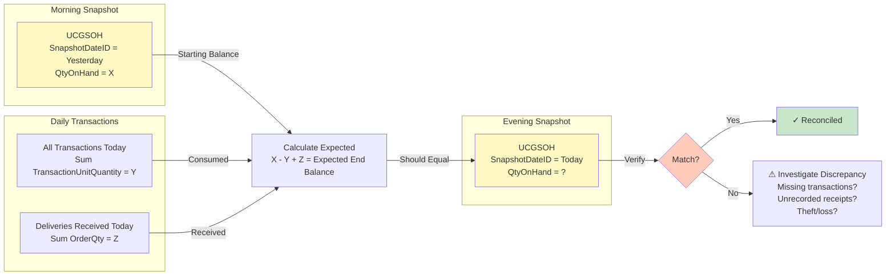

```mermaid
flowchart LR
    subgraph "Morning Snapshot"
        M1[UCGSOH<br/>SnapshotDateID = Yesterday<br/>QtyOnHand = X]
    end
    
    subgraph "Daily Transactions"
        D1[All Transactions Today<br/>Sum TransactionUnitQuantity = Y]
        D2[Deliveries Received Today<br/>Sum OrderQty = Z]
    end
    
    subgraph "Evening Snapshot"
        E1[UCGSOH<br/>SnapshotDateID = Today<br/>QtyOnHand = ?]
    end
    
    M1 -->|Starting Balance| Calc[Calculate Expected<br/>X - Y + Z = Expected End Balance]
    D1 -->|Consumed| Calc
    D2 -->|Received| Calc
    
    Calc -->|Should Equal| E1
    E1 -->|Verify| Check{Match?}
    
    Check -->|Yes| OK[✓ Reconciled]
    Check -->|No| Investigate[⚠ Investigate Discrepancy<br/>Missing transactions?<br/>Unrecorded receipts?<br/>Theft/loss?]
    
    style M1 fill:#fff9c4
    style E1 fill:#fff9c4
    style Check fill:#ffccbc
    style OK fill:#c8e6c9
```
