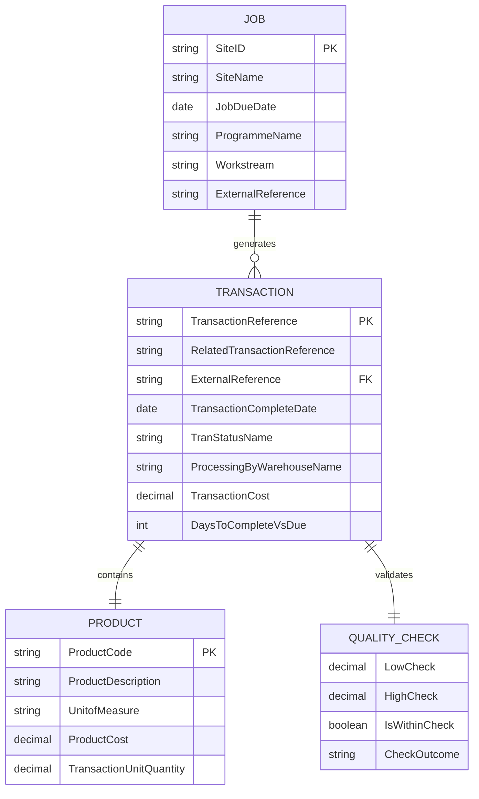

## Data relationships

```mermaid
erDiagram
    JOB ||--o{ TRANSACTION : generates
    JOB {
        string SiteID PK
        string SiteName
        date JobDueDate
        string ProgrammeName
        string Workstream
        string ExternalReference
    }
    
    TRANSACTION ||--|| PRODUCT : contains
    TRANSACTION {
        string TransactionReference PK
        string RelatedTransactionReference
        string ExternalReference FK
        date TransactionCompleteDate
        string TranStatusName
        string ProcessingByWarehouseName
        decimal TransactionCost
        int DaysToCompleteVsDue
    }
    
    PRODUCT {
        string ProductCode PK
        string ProductDescription
        string UnitofMeasure
        decimal ProductCost
        decimal TransactionUnitQuantity
    }
    
    TRANSACTION ||--|| QUALITY_CHECK : validates
    QUALITY_CHECK {
        decimal LowCheck
        decimal HighCheck
        boolean IsWithinCheck
        string CheckOutcome
    }
```
