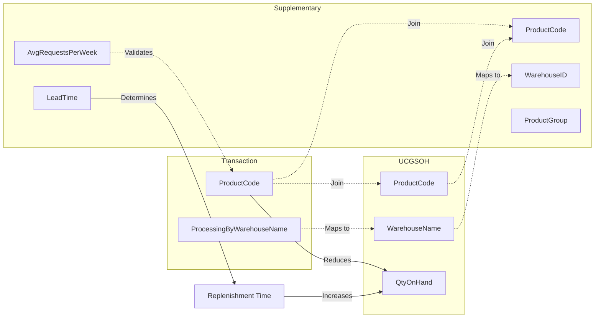

```mermaid
flowchart LR
    subgraph Transaction
        T1[ProductCode]
        T2[ProcessingByWarehouseName]
    end
    
    subgraph UCGSOH
        S1[ProductCode]
        S2[WarehouseName]
        S3[QtyOnHand]
    end
    
    subgraph Supplementary
        P1[ProductCode]
        P2[WarehouseID]
        P3[LeadTime]
        P4[AvgRequestsPerWeek]
        P5[ProductGroup]
    end
    
    T1 -.->|Join| S1
    T1 -.->|Join| P1
    S1 -.->|Join| P1
    
    T2 -.->|Maps to| S2
    S2 -.->|Maps to| P2
    
    T1 -->|Reduces| S3
    P3 -->|Determines| ReplenishTime[Replenishment Time]
    ReplenishTime -->|Increases| S3
    
    P4 -.->|Validates| T1
```
