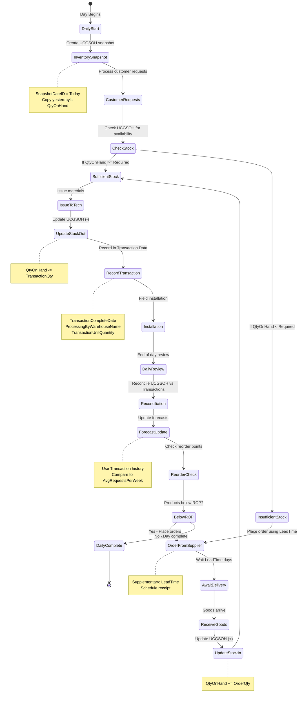

```mermaid
stateDiagram-v2
    [*] --> DailyStart: Day Begins
    
    DailyStart --> InventorySnapshot: Create UCGSOH snapshot
    note right of InventorySnapshot
        SnapshotDateID = Today
        Copy yesterday's QtyOnHand
    end note
    
    InventorySnapshot --> CustomerRequests: Process customer requests
    
    CustomerRequests --> CheckStock: Check UCGSOH for availability
    
    CheckStock --> SufficientStock: If QtyOnHand >= Required
    CheckStock --> InsufficientStock: If QtyOnHand < Required
    
    InsufficientStock --> OrderFromSupplier: Place order using LeadTime
    note right of OrderFromSupplier
        Supplementary: LeadTime
        Schedule receipt
    end note
    
    OrderFromSupplier --> AwaitDelivery: Wait LeadTime days
    
    AwaitDelivery --> ReceiveGoods: Goods arrive
    
    ReceiveGoods --> UpdateStockIn: Update UCGSOH (+)
    note right of UpdateStockIn
        QtyOnHand += OrderQty
    end note
    
    UpdateStockIn --> SufficientStock
    
    SufficientStock --> IssueToTech: Issue materials
    
    IssueToTech --> UpdateStockOut: Update UCGSOH (-)
    note right of UpdateStockOut
        QtyOnHand -= TransactionQty
    end note
    
    UpdateStockOut --> RecordTransaction: Record in Transaction Data
    note right of RecordTransaction
        TransactionCompleteDate
        ProcessingByWarehouseName
        TransactionUnitQuantity
    end note
    
    RecordTransaction --> Installation: Field installation
    
    Installation --> DailyReview: End of day review
    
    DailyReview --> Reconciliation: Reconcile UCGSOH vs Transactions
    
    Reconciliation --> ForecastUpdate: Update forecasts
    note right of ForecastUpdate
        Use Transaction history
        Compare to AvgRequestsPerWeek
    end note
    
    ForecastUpdate --> ReorderCheck: Check reorder points
    
    ReorderCheck --> BelowROP: Products below ROP?
    
    BelowROP --> OrderFromSupplier: Yes - Place orders
    BelowROP --> DailyComplete: No - Day complete
    
    DailyComplete --> [*]
```
