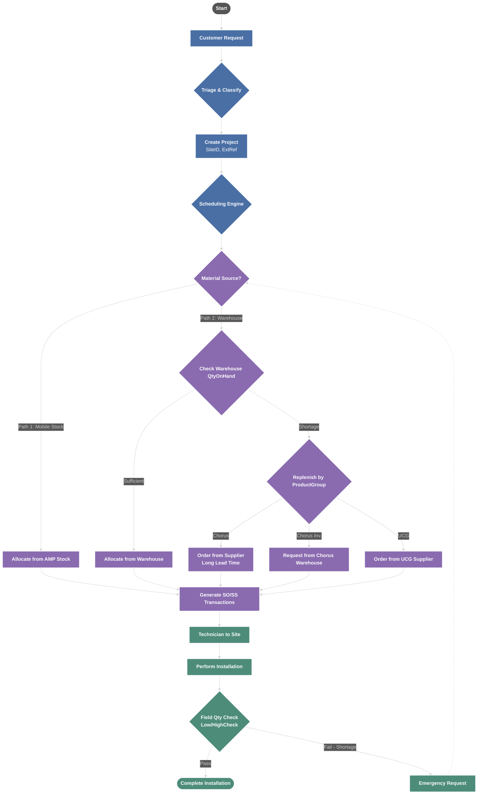

```mermaid
%%{init: {'theme': 'dark', 'themeVariables': { 'background': '#000000', 'primaryTextColor': '#ffffff', 'fontFamily': 'Arial, sans-serif', 'fontWeight': 'bold'}}}%%
flowchart TD
    Start([<b>Start</b>]):::start

    A[<b>Customer Request</b>]:::phase1
    B{<b>Triage & Classify</b>}:::phase1
    C[<b>Create Project</b><br>SiteID, ExtRef]:::phase1
    D{<b>Scheduling Engine</b>}:::phase1

    E{<b>Material Source?</b>}:::phase2
    F[<b>Allocate from AMP Stock</b>]:::phase2
    G{<b>Check Warehouse QtyOnHand</b>}:::phase2
    H[<b>Allocate from Warehouse</b>]:::phase2
    I{<b>Replenish by ProductGroup</b>}:::phase2
    J[<b>Order from Supplier<br>Long Lead Time</b>]:::phase2
    K[<b>Request from Chorus Warehouse</b>]:::phase2
    L[<b>Order from UCG Supplier</b>]:::phase2
    M[<b>Generate SO/SS Transactions</b>]:::phase2

    N[<b>Technician to Site</b>]:::phase3
    O[<b>Perform Installation</b>]:::phase3
    P{<b>Field Qty Check<br>Low/HighCheck</b>}:::phase3
    Q([<b>Complete Installation</b>]):::phase3
    R[<b>Emergency Request</b>]:::phase3

    Start --> A
    A --> B
    B --> C
    C --> D
    D --> E

    E -->|Path 1: Mobile Stock| F
    E -->|Path 2: Warehouse| G
    G -->|Sufficient| H
    G -->|Shortage| I

    I -->|Chorus| J
    I -->|Chorus Inv.| K
    I -->|UCG| L

    F --> M
    H --> M
    J --> M
    K --> M
    L --> M

    M --> N
    N --> O
    O --> P
    P -->|Pass| Q

    P -->|Fail - Shortage| R
    R -.-> E

    classDef start fill:#555,stroke:#fff,stroke-width:2px,color:#fff;
    classDef phase1 fill:#4a6fa5,stroke:#fff,stroke-width:2px,color:#fff;
    classDef phase2 fill:#8a6baf,stroke:#fff,stroke-width:2px,color:#fff;
    classDef phase3 fill:#4e8c7a,stroke:#fff,stroke-width:2px,color:#fff;
```
