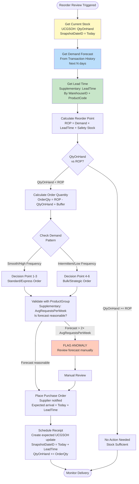

```mermaid
flowchart TD
    Start([Reorder Review Triggered]) --> GetCurrent[Get Current Stock<br/>UCGSOH: QtyOnHand<br/>SnapshotDateID = Today]
    
    GetCurrent --> GetForecast[Get Demand Forecast<br/>From Transaction History<br/>Next N days]
    
    GetForecast --> GetLeadTime[Get Lead Time<br/>Supplementary: LeadTime<br/>By WarehouseID + ProductCode]
    
    GetLeadTime --> CalcROP[Calculate Reorder Point<br/>ROP = Demand × LeadTime + Safety Stock]
    
    CalcROP --> Compare{QtyOnHand<br/>vs ROP?}
    
    Compare -->|QtyOnHand >= ROP| NoAction[No Action Needed<br/>Stock Sufficient]
    
    Compare -->|QtyOnHand < ROP| CalcOrder[Calculate Order Quantity<br/>OrderQty = ROP - QtyOnHand + Buffer]
    
    CalcOrder --> CheckPattern{Check Demand<br/>Pattern}
    
    CheckPattern -->|Smooth/High Frequency| Decision1[Decision Point 1-3<br/>Standard/Express Order]
    
    CheckPattern -->|Intermittent/Low Frequency| Decision2[Decision Point 4-6<br/>Bulk/Strategic Order]
    
    Decision1 --> ValidateGroup[Validate with ProductGroup<br/>Supplementary: AvgRequestsPerWeek<br/>Is forecast reasonable?]
    
    Decision2 --> ValidateGroup
    
    ValidateGroup -->|Forecast > 2× AvgRequestsPerWeek| FlagAnomaly[FLAG ANOMALY<br/>Review forecast manually]
    
    ValidateGroup -->|Forecast reasonable| PlaceOrder[Place Purchase Order<br/>Supplier notified<br/>Expected arrival = Today + LeadTime]
    
    FlagAnomaly --> ManualReview[Manual Review]
    ManualReview --> PlaceOrder
    
    PlaceOrder --> ScheduleReceive[Schedule Receipt<br/>Create expected UCGSOH update<br/>SnapshotDateID = Today + LeadTime<br/>QtyOnHand += OrderQty]
    
    ScheduleReceive --> End([Monitor Delivery])
    NoAction --> End
    
    style GetCurrent fill:#fff9c4
    style GetForecast fill:#bbdefb
    style GetLeadTime fill:#c8e6c9
    style FlagAnomaly fill:#ffccbc
```
