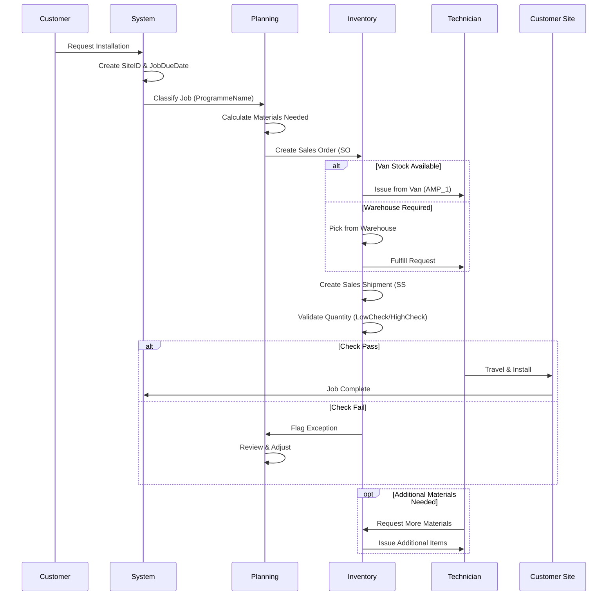

## Transaction Flow

```mermaid
sequenceDiagram
    participant C as Customer
    participant S as System
    participant P as Planning
    participant I as Inventory
    participant T as Technician
    participant Site as Customer Site

    C->>S: Request Installation
    S->>S: Create SiteID & JobDueDate
    S->>P: Classify Job (ProgrammeName)
    P->>P: Calculate Materials Needed
    P->>I: Create Sales Order (SO####)
    
    alt Van Stock Available
        I->>T: Issue from Van (AMP_1)
    else Warehouse Required
        I->>I: Pick from Warehouse
        I->>T: Fulfill Request
    end
    
    I->>I: Create Sales Shipment (SS####)
    I->>I: Validate Quantity (LowCheck/HighCheck)
    
    alt Check Pass
        T->>Site: Travel & Install
        Site->>S: Job Complete
    else Check Fail
        I->>P: Flag Exception
        P->>P: Review & Adjust
    end
    
    opt Additional Materials Needed
        T->>I: Request More Materials
        I->>T: Issue Additional Items
    end
```
