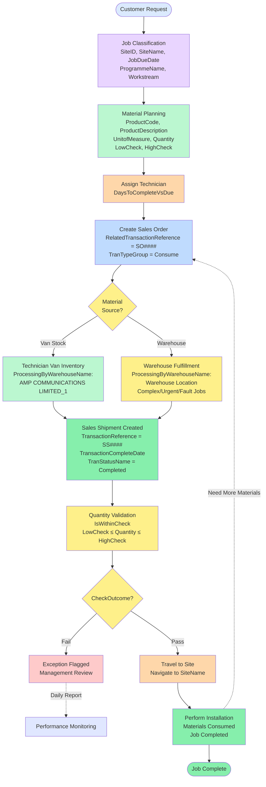

```mermaid
flowchart TD
    Start([Customer Request]) --> A[Job Classification<br/>SiteID, SiteName, JobDueDate<br/>ProgrammeName, Workstream]
    
    A --> B[Material Planning<br/>ProductCode, ProductDescription<br/>UnitofMeasure, Quantity<br/>LowCheck, HighCheck]
    
    B --> C[Assign Technician<br/>DaysToCompleteVsDue]
    
    C --> D[Create Sales Order<br/>RelatedTransactionReference = SO####<br/>TranTypeGroup = Consume]
    
    D --> E{Material<br/>Source?}
    
    E -->|Van Stock| F[Technician Van Inventory<br/>ProcessingByWarehouseName:<br/>AMP COMMUNICATIONS LIMITED_1]
    
    E -->|Warehouse| G[Warehouse Fulfillment<br/>ProcessingByWarehouseName:<br/>Warehouse Location<br/>Complex/Urgent/Fault Jobs]
    
    F --> H[Sales Shipment Created<br/>TransactionReference = SS####<br/>TransactionCompleteDate<br/>TranStatusName = Completed]
    
    G --> H
    
    H --> I[Quantity Validation<br/>IsWithinCheck<br/>LowCheck ≤ Quantity ≤ HighCheck]
    
    I --> J{CheckOutcome?}
    
    J -->|Fail| K[Exception Flagged<br/>Management Review]
    K -.->|Daily Report| L[Performance Monitoring]
    
    J -->|Pass| M[Travel to Site<br/>Navigate to SiteName]
    
    M --> N[Perform Installation<br/>Materials Consumed<br/>Job Completed]
    
    N -.->|Need More Materials| D
    
    N --> O([Job Complete])

    style A fill:#e9d5ff
    style B fill:#bbf7d0
    style C fill:#fed7aa
    style D fill:#bfdbfe
    style E fill:#fef08a
    style F fill:#bbf7d0
    style G fill:#fef08a
    style H fill:#86efac
    style I fill:#fef08a
    style J fill:#fef08a
    style K fill:#fecaca
    style L fill:#e0e7ff
    style M fill:#fed7aa
    style N fill:#86efac
    style Start fill:#dbeafe
    style O fill:#86efac
```
